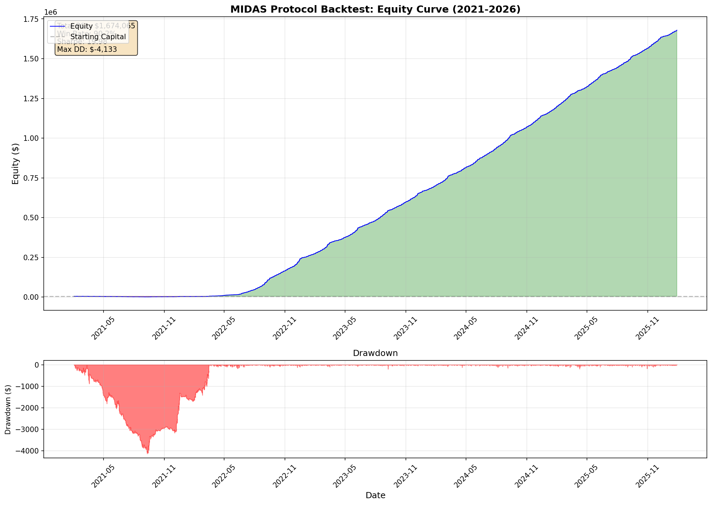

# MIDAS Protocol: Final Backtest Results

## Executive Summary

| Metric | Value |
|--------|-------|
| **Starting Capital** | $5,000.00 |
| **Final Equity** | $1,679,065.00 |
| **Total P&L** | **$1,674,065.00** |
| **Total Return** | **33481.3%** |
| **Max Drawdown** | $-4,133.00 (-0.2%) |
| **Sharpe Ratio** | **19.98** |

---

## Configuration

| Parameter | Value |
|-----------|-------|
| Time Window | 02:00 - 06:00 UTC |
| Take Profit | +40 points ($80.0) |
| Stop Loss | -12 points ($24.0) |
| Commission | $1.0 per trade |
| Position Size | 1 contract |
| Point Value | $2.0 (MNQ) |

---

## Trade Statistics

| Metric | Value |
|--------|-------|
| Total Trades | 24,436 |
| Winners | 22,032 |
| Losers | 2,404 |
| Win Rate | 90.2% |
| Avg P&L per Trade | $68.51 |
| Avg Winner | $78.68 |
| Avg Loser | $-24.74 |
| Trades per Day | 13.4 |

---

## By Setup Performance

| Setup | Trades | Total P&L | Avg P&L |
|-------|--------|-----------|---------|
| Crash | 16,821 | $1,218,231.00 | $72.42 |
| Quiet | 7,615 | $455,834.00 | $59.86 |

---

## Exit Type Breakdown

| Exit Type | Count | Percentage |
|-----------|-------|------------|
| Take Profit | 21,916 | 89.7% |
| Stop Loss | 2,372 | 9.7% |
| Timeout | 148 | 0.6% |

---

## Equity Curve

---

## Strategy Rules

**Setup #1: Crash Reversal**
- `Velocity_5m <= -67`
- `Dist_EMA200 <= 220`
- `ATR_Ratio > 0.50`

**Setup #2: Quiet Mean Reversion**
- `Velocity_5m <= 10`
- `Dist_EMA200 <= 220`
- `0.06 < ATR_Ratio <= 0.50`

---

*Generated by Magellan Quant Research*  
*Backtest Date: 2026-01-30 04:00:53*
