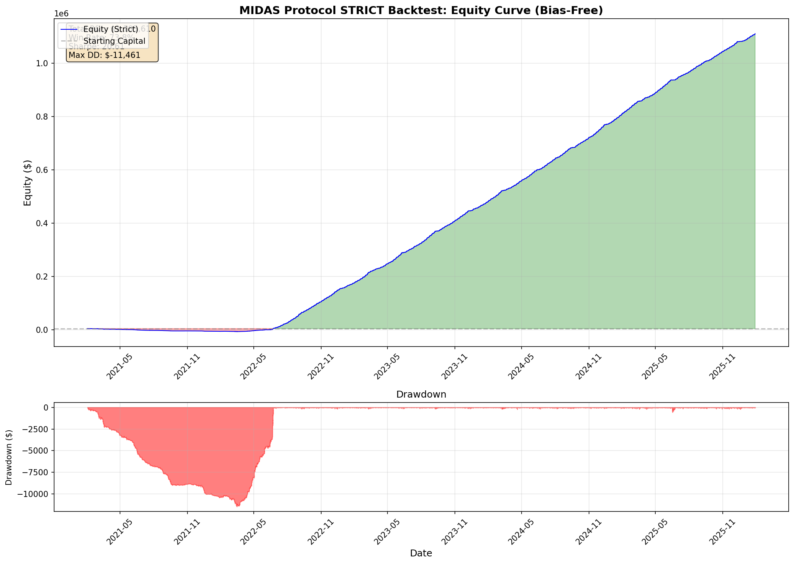

# MIDAS Protocol: STRICT Backtest Results (Bias-Free)

## Audit Fixes Applied

| Fix | Description |
|-----|-------------|
| **Execution Delay** | Signal on Close[i] -> Execute on Open[i+1] |
| **Worst Case Intra-Bar** | If both TP & SL hit same bar, assume SL hit FIRST |
| **Slippage** | 0.5 points per trade ($1.0 per contract) |

---

## Executive Summary

| Metric | Value |
|--------|-------|
| **Starting Capital** | $5,000.00 |
| **Final Equity** | $1,110,610.50 |
| **Total P&L** | **$1,105,610.50** |
| **Total Return** | **22112.2%** |
| **Max Drawdown** | $-11,461.00 (-1.0%) |
| **Sharpe Ratio** | **20.61** |

---

## Comparison: Original vs Strict

| Metric | Original (Biased) | Strict (Bias-Free) | Delta |
|--------|-------------------|---------------------|-------|
| Win Rate | 90.2% | 73.8% | -16.4% |
| Total P&L | $1,674,065 | $1,105,610 | $-568,454 |
| Sharpe | 19.98 | 20.61 | +0.63 |
| Total Trades | 24,436 | 21,894 | -2,542 |

---

## Trade Statistics

| Metric | Value |
|--------|-------|
| Total Trades | 21,894 |
| Winners | 16,165 |
| Losers | 5,729 |
| Win Rate | 73.8% |
| Avg P&L per Trade | $50.50 |
| Avg Winner | $77.57 |
| Avg Loser | $-25.89 |

---

## Exit Type Breakdown

| Exit Type | Count | Percentage |
|-----------|-------|------------|
| Take Profit | 16,049 | 73.3% |
| Stop Loss | 5,697 | 26.0% |
| Timeout | 148 | 0.7% |

---

## Equity Curve

---

*Generated by Magellan Quant Research - AUDIT MODE*  
*Backtest Date: 2026-01-30 04:06:49*
