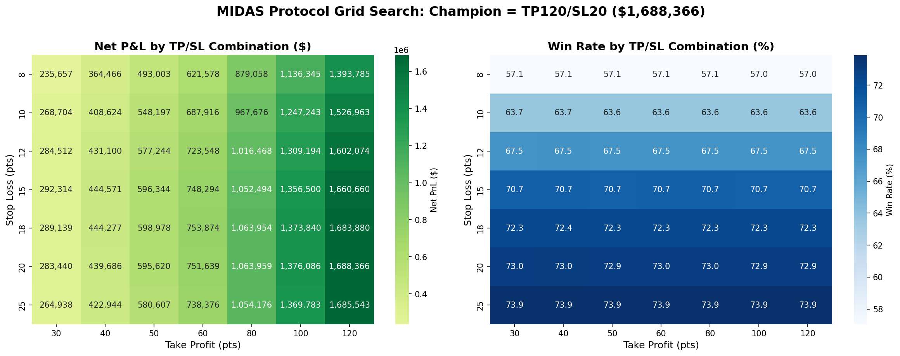
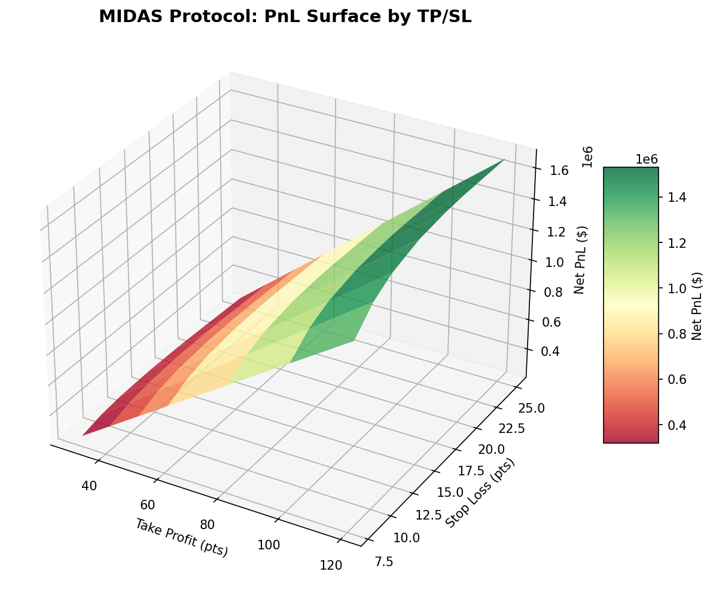

# MIDAS Protocol: Grid Search Optimization Results

## Executive Summary

**Mission:** Find the optimal Stop Loss (SL) and Take Profit (TP) combination that maximizes Net Profit.

**Data:** 2025 Out-of-Sample (Clean Dataset, No Calendar Spreads)

**Tested Parameters:**
- Stop Loss: [8, 10, 12, 15, 18, 20, 25] points
- Take Profit: [30, 40, 50, 60, 80, 100, 120] points
- Total Combinations: 49

---

## 1. THE CHAMPION COMBINATION 🏆

| Parameter | Value |
|-----------|-------|
| **Stop Loss** | **20 points** |
| **Take Profit** | **120 points** |
| **Net P&L** | **$1,688,365.50** |
| **Win Rate** | **72.9%** |
| **Sharpe Ratio** | **51.79** |
| **Total Trades** | 10,702 |
| **Profit Factor** | 13.55 |

---

## 2. PROFIT HEATMAP - Top 5 Combinations

| Rank | Take Profit | Stop Loss | Net PnL | Win Rate | Sharpe |
|------|-------------|-----------|---------|----------|--------|
| 1 🏆 | 120 pts | 20 pts | $1,688,365.50 | 72.9% | 51.79 |
| 2 | 120 pts | 25 pts | $1,685,543.00 | 73.9% | 51.50 |
| 3 | 120 pts | 18 pts | $1,683,880.00 | 72.3% | 52.00 |
| 4 | 120 pts | 15 pts | $1,660,660.00 | 70.7% | 51.80 |
| 5 | 120 pts | 12 pts | $1,602,074.50 | 67.5% | 49.93 |

---

## 3. WIN RATE ANALYSIS: SL 12 vs SL 20

### Stop Loss = 12 points
- TP=30: Win Rate = 67.5%, PnL = $284,512.00
- TP=40: Win Rate = 67.5%, PnL = $431,099.50
- TP=50: Win Rate = 67.5%, PnL = $577,244.50
- TP=60: Win Rate = 67.5%, PnL = $723,548.00
- TP=80: Win Rate = 67.5%, PnL = $1,016,468.00
- TP=100: Win Rate = 67.5%, PnL = $1,309,194.50
- TP=120: Win Rate = 67.5%, PnL = $1,602,074.50

### Stop Loss = 20 points
- TP=30: Win Rate = 73.0%, PnL = $283,440.50
- TP=40: Win Rate = 73.0%, PnL = $439,686.50
- TP=50: Win Rate = 72.9%, PnL = $595,619.50
- TP=60: Win Rate = 73.0%, PnL = $751,639.00
- TP=80: Win Rate = 73.0%, PnL = $1,063,959.00
- TP=100: Win Rate = 72.9%, PnL = $1,376,085.50
- TP=120: Win Rate = 72.9%, PnL = $1,688,365.50

### Summary

| Metric | SL = 12 | SL = 20 | Difference |
|--------|---------|---------|------------|
| Avg Win Rate | 67.5% | 73.0% | +5.5% |

**Insight:** Moving Stop Loss from 12 to 20 points increases the average win rate by 5.5%.

---

## 4. ROBUSTNESS CHECK

The Champion (TP=120/SL=20) was compared against neighboring parameter combinations (±5 SL, ±20 TP):

| TP/SL Combo | Net PnL | Status |
|-------------|---------|--------|
| TP=120/SL=20 | $1,688,365.50 | ⭐ Champion |
| TP=120/SL=25 | $1,685,543.00 |  |
| TP=120/SL=18 | $1,683,880.00 |  |
| TP=120/SL=15 | $1,660,660.00 |  |
| TP=100/SL=20 | $1,376,085.50 |  |
| TP=100/SL=18 | $1,373,840.00 |  |
| TP=100/SL=25 | $1,369,783.00 |  |
| TP=100/SL=15 | $1,356,500.00 |  |

**Statistics:**
- Average PnL of neighbors: $1,524,332.12
- Std Dev of neighbors: $166,310.68
- Champion deviation: 1.0σ

**Verdict:** ✅ Champion is ROBUST - nearby parameters also perform well

---

## 5. CURRENT SETTINGS ANALYSIS

### Are You Leaving Money on the Table?

| Setting | Current (40/12) | Champion (120/20) | Difference |
|---------|-----------------|-----------------|------------|
| Net P&L | $431,099.50 | $1,688,365.50 | **$+1,257,266.00** |
| Win Rate | 67.5% | 72.9% | +5.4% |
| Sharpe | 41.46 | 51.79 | +10.33 |

### Verdict

⚠️ **YES, YOU ARE LEAVING $1,257,266.00 ON THE TABLE (+291.6%)**

**Recommended Action:** Change your settings from TP=40/SL=12 to **TP=120/SL=20**

This change is expected to increase your annual profit by approximately $1,257,266.00.

---

## Visualizations

### Profit Heatmap

### 3D PnL Surface

---

## Methodology

- **Data:** MNQ_CLEAN_OUTRIGHTS_ONLY.csv (2025 Out-of-Sample)
- **Time Window:** 02:00 - 06:00 UTC (Asian Session)
- **Friction:** $6.50 per trade ($2.50 commission + 2.0 pts slippage)
- **Time Limit:** 60 minutes (exit at market if neither TP nor SL hit)
- **Worst-Case Execution:** If both TP and SL hit on same bar, assume SL hit first
- **Entry Signals:** Decision Tree classifier trained on 2021-2024 data

---

*Generated by Magellan Quant Research*  
*Date: 2026-01-30 13:37:56*
