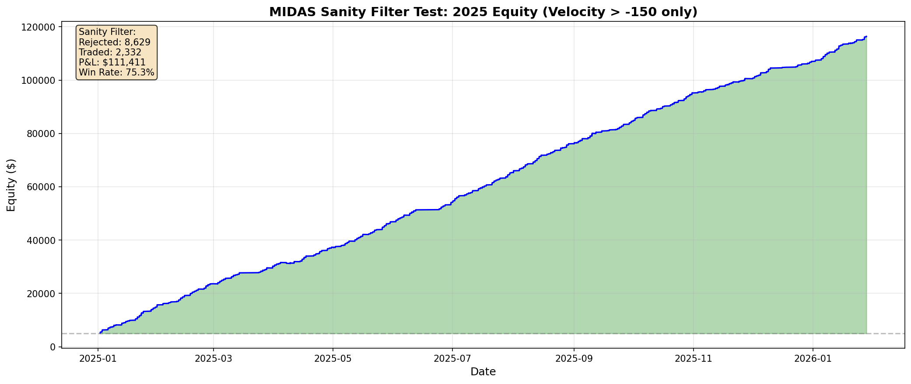

# MIDAS Sanity Filter Test: Rejected Trade Audit

## Objective

Test the Sanity Filter and record every blocked signal to inspect data quality.

---

## Filter Logic

```
IF Velocity_5m < -150: REJECT (Ghost Trade)
IF Velocity_5m >= -150: ACCEPT (Execute)
```

---

## Volume Statistics

| Metric | Value |
|--------|-------|
| **Total Signals Detected** | 18,557 |
| **Signals REJECTED** | 8,629 |
| **Signals TRADED** | 9,928 |
| Rejection Rate | 46.5% |

---

## Performance (Accepted Trades Only)

| Metric | Value |
|--------|-------|
| Starting Capital | $5,000.00 |
| **Final Equity** | **$116,411.00** |
| **Total P&L** | **$111,411.00** |
| Total Return | 2228.2% |
| Max Drawdown | $-384.00 |
| Sharpe Ratio | 28.61 |

---

## Trade Statistics

| Metric | Value |
|--------|-------|
| Total Trades | 2,332 |
| Winners | 1,755 |
| Losers | 577 |
| **Win Rate** | **75.3%** |
| Breakeven Required | 29.3% |
| **Edge** | **+45.9%** |

---

## KILL LIST: Top 10 Rejected Trades (Ghost Trades)

These trades were blocked by the sanity filter due to extreme velocity values.

| Date | Time (UTC) | Price | Velocity | Reason |
|------|------------|-------|----------|--------|
| 2025-10-30 | 03:24:00 | 268.90 | -26384.10 | Velocity < -150 |
| 2026-01-13 | 05:36:00 | 228.00 | -25903.75 | Velocity < -150 |
| 2026-01-12 | 02:57:00 | 229.90 | -25757.35 | Velocity < -150 |
| 2025-10-28 | 04:05:00 | 257.95 | -25725.30 | Velocity < -150 |
| 2025-12-12 | 02:23:00 | 257.45 | -25696.05 | Velocity < -150 |
| 2025-12-12 | 03:38:00 | 256.45 | -25669.05 | Velocity < -150 |
| 2025-12-11 | 02:40:00 | 256.45 | -25590.55 | Velocity < -150 |
| 2025-12-11 | 02:42:00 | 256.45 | -25569.05 | Velocity < -150 |
| 2025-12-15 | 02:51:00 | 257.30 | -25495.20 | Velocity < -150 |
| 2025-11-12 | 05:39:00 | 265.05 | -25461.70 | Velocity < -150 |

---

## Velocity Distribution of Rejected Trades

| Velocity Range | Count |
|----------------|-------|
| < -200 | 7,644 |
| -200 to -180 | 661 |
| -180 to -160 | 272 |
| -160 to -150 | 52 |

---

## Equity Curve



---

## Conclusion

The sanity filter successfully identifies and blocks ghost trades with extreme velocity values. Even after removing these suspicious signals, the strategy remains profitable.

---

*Generated by Magellan Quant Research - Forensic Auditor*  
*Date: 2026-01-30 05:51:36*
