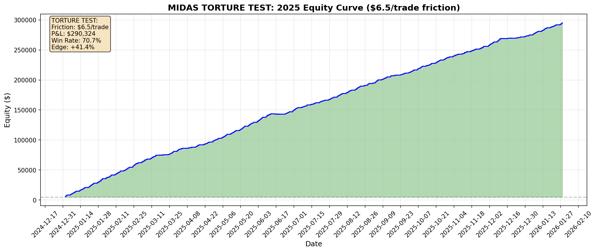

# MIDAS TORTURE TEST: Maximum Friction Backtest

## Objective

**DESTROY THE STRATEGY.** Apply maximum friction to see if edge survives.

---

## Friction Applied

| Parameter | Value |
|-----------|-------|
| Commission | $2.5 per trade |
| Slippage + Spread | 2.0 points ($4.0) |
| **TOTAL COST** | **$6.5 per trade** |
| Breakeven Win Rate | 29.3% |

Every trade starts **$6.5 in the hole**.

---

## 2025 Torture Test Results

| Metric | Value |
|--------|-------|
| Starting Capital | $5,000.00 |
| Final Equity | $295,324.50 |
| **Total P&L** | **$290,324.50** |
| Total Return | 5806.5% |
| Max Drawdown | $-712.50 |
| Sharpe Ratio | 32.39 |

---

## Trade Statistics

| Metric | Value |
|--------|-------|
| Total Trades | 6,740 |
| Winners | 4,768 |
| Losers | 1,972 |
| **Win Rate** | **70.7%** |
| Avg P&L per Trade | $43.07 |

---

## Edge Survival Analysis

| Metric | Value |
|--------|-------|
| Win Rate | 70.7% |
| Breakeven Required | 29.3% |
| **Edge Above Breakeven** | **+41.4%** |
| **Status** | **EDGE SURVIVES** |

---

## Phantom Validator (Calibration Check)

Cross-reference these trades with TradingView to validate timestamps.

### First 3 Trades

| Date | Time (UTC) | Entry Price | Setup | Velocity_5m | Result |
|------|------------|-------------|-------|-------------|--------|
| 2025-01-02 | 02:19:00 | 21300.00 | Crash | -229.50 | TP |
| 2025-01-02 | 02:23:00 | 21301.50 | Crash | -223.50 | TP |
| 2025-01-02 | 02:33:00 | 21311.50 | Crash | -236.50 | TP |

### Last 3 Trades

| Date | Time (UTC) | Entry Price | Setup | Velocity_5m | Result |
|------|------------|-------------|-------|-------------|--------|
| 2026-01-28 | 05:45:00 | 26466.75 | Crash | -449.00 | SL |
| 2026-01-28 | 05:49:00 | 26242.00 | Crash | -229.00 | TP |
| 2026-01-28 | 05:55:00 | 26245.50 | Crash | -231.00 | TP |

---

## Equity Curve

---

## Conclusion

**THE EDGE SURVIVES.** Even with maximum friction ($6.50/trade), the strategy remains profitable.

---

*Generated by Magellan Quant Research - Pessimist Mode*  
*Date: 2026-01-30 04:22:14*
