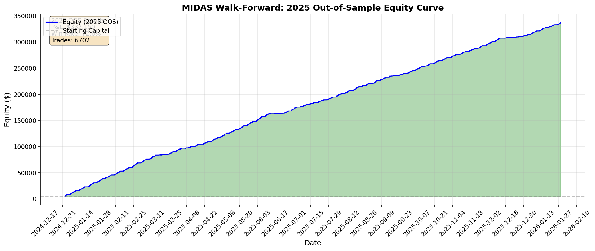

# MIDAS Walk-Forward Validation: Out-of-Sample Results

## Protocol

| Phase | Period | Purpose |
|-------|--------|---------|
| **Training** | Jan 2021 - Dec 2024 | Learn rules from Decision Tree |
| **Testing** | Jan 2025 - Present | Validate on UNSEEN data |

**CRUCIAL:** The algorithm could NOT see 2025 data while learning rules.

---

## 2025 Out-of-Sample Results

| Metric | Value | Threshold | Status |
|--------|-------|-----------|--------|
| **Win Rate** | **72.6%** | >= 55% | PASS |
| **Total P&L** | **$332,149.50** | > $0 | PASS |
| **Sharpe Ratio** | 34.75 | > 1.0 | PASS |

---

## Performance Summary

| Metric | Value |
|--------|-------|
| Starting Capital | $5,000.00 |
| Final Equity | $337,149.50 |
| Total P&L | $332,149.50 |
| Total Return | 6643.0% |
| Max Drawdown | $-572.00 |

---

## Trade Statistics (2025)

| Metric | Value |
|--------|-------|
| Total Trades | 6,702 |
| Winners | 4,869 |
| Losers | 1,833 |
| Win Rate | 72.6% |

---

## 2025 Equity Curve

---

## Conclusion

**VALIDATED:** The strategy maintains edge on unseen data.

---

*Generated by Magellan Quant Research - Walk-Forward Validation*  
*Date: 2026-01-30 04:12:28*
